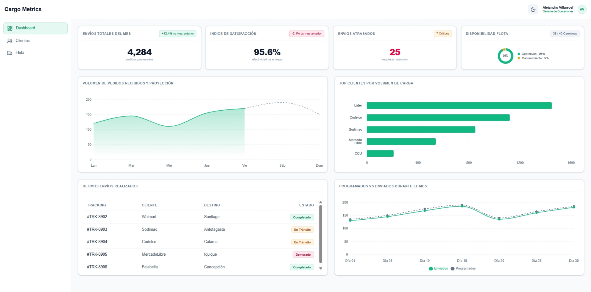
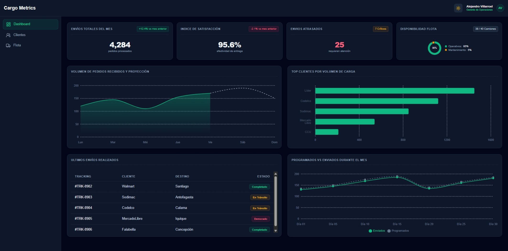
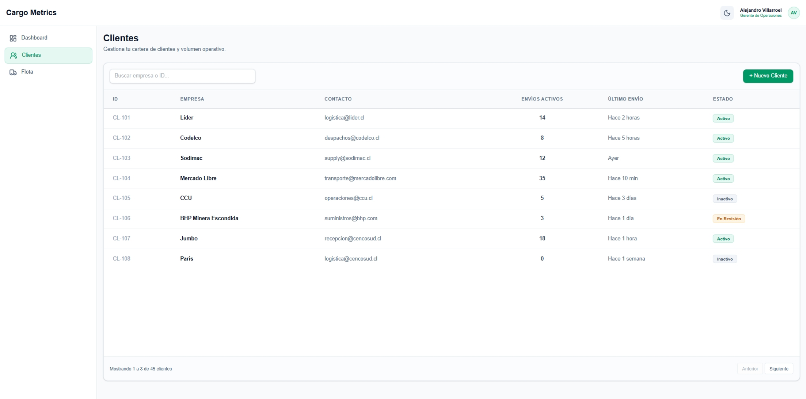
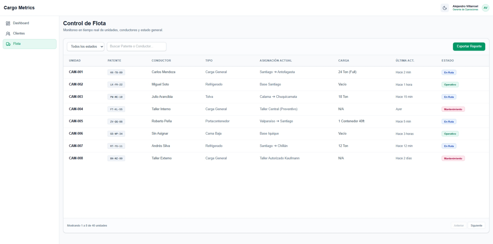

# 🚚 CargoMetrics | Dashboard de logistica

Demo de plataforma web enfocada en el monitoreo de flotas, clientes y operaciones logísticas B2B, enfocandose en la presentacion de datos orientados para la toma de decisiones gerenciales.

> La demo está compuesta por 3 vistas, cuenta con modo oscuro y con adaptabilidad para dispositivos móviles. Los datos presentados son puramente representativos.

## 🛠️ Tecnologías Utilizadas

- **Framework:** [Next.js](https://nextjs.org/)
- **Estilos:** [Tailwind CSS](https://tailwindcss.com/)
- **Gráficos:** [Recharts](https://recharts.org/)
- **Iconos:** [Lucide React](https://lucide.dev/)

## 📸 Capturas de pantallas

**Vista de Dashboard**
  

**Vista de Dashboard en modo oscuro**
  

**Vista de Clientes**
  

**Vista de Flota**


## 💻 Instalación y Configuración Local

Si deseas correr este proyecto en tu propio entorno:

1. Clona el repositorio:
   ```bash
    git clone https://github.com/Alejandro-VH/CargoMetrics.git
    cd CargoMetrics
    ```
2. Instalar dependencias
    ```bash
    npm install
    ```
3. Iniciar el frontend
    ```bash
    npm run dev
    ```
4. Abre [http://localhost:3000](http://localhost:3000) en tu navegador.